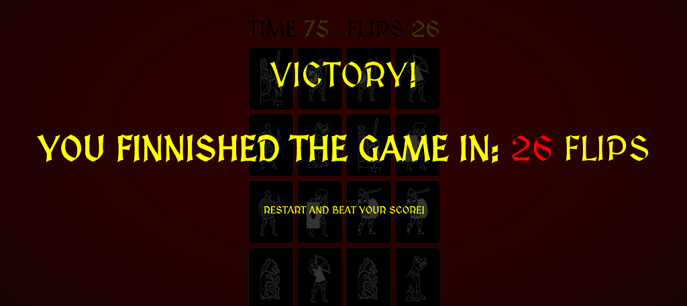

# Match The Spartans
Milestone Project #2 : Interactive Frontend Development  - Code Institute 

## Demo
[Live demo](https://nikolaspolychronidis.github.io/Match-The-Spartans/) is available here.

I have built a small card matching game. The game's theme is based on ancient Greek history. The player is supposed to match every pair of cards within 200 seconds.
The back of the cards carries a red black Lamda, the first letter of the word Lacedemonians, the name Spartans and surrounding settlements called themselves. 
The front of the cards carries pairs of different soldier icons.

## UX

The purpose of this project is to create a fun and aesthetically pleasing matching game. 

**Client Stories**

1. As a player I would like to be presented with a board of cards so that when I start the game I can flip the cards to find the matching ones.
2. As a player I would like a unique theme and design other than what most memory games have, maybe a historical theme would be suitable for a game like this.
3. As a player I would like time to trickle down from say 100 seconds instead of it starting at 00:00 and be infinite to make the game more challenging.
4. As a player I would the score to include the number of flips rather than time elapsed, so that I can try to beat the game in less flips.
Time based score is irrelevant since anyone can just click infinetely to reveal all cards and match them. In that case the game becomes a speed rather than memory game.

**In order to achieve the above fun and aesthetically pleasing game I did the following:**

- When the game is launched a start screen pops up with a message. The player is told to prepare and click to play.

- The back of the cards carries a red black Lamda, the first letter of the word Lacedemonians, the name Spartans and surrounding settlements called themselves.

- The front of the cards carries pairs of different soldier icons. The player is supposed to match them in pairs. When Cards are matched they remain as they are with the soldiers display.

- If the cards do not match they are flipped and the player sees the Lamda again.

- If the time runs out before the player has managed to match all the card then a failure screen is displayed.

- If the player matches all the cards before time runs out, then a victory message is displayed.

>I did my best to keep the colors as of the website as consistent as possible, in order to ensure a possitive user experience.

 
 ### Wireframe Mockups
 
 These can be found at the following links below:
- [Single page wireframe](assets/images/wireframe.jpg)
 

## Technologies
1. HTML
2. CSS
3. JavaScript
4. Google Fonts

## Testing
This web application was physically tested for display as well as gameplay across multiple browsers  (Chrome, Safari, FireFox, Opera) and on multiple mobile devices using Google developer tool(iPad, iPad Pro, iPhone X, iPhone 6/7/8 (Plus), iPhone 5/SE, Pixel 2 (XL), Galaxy S5). The site is compatible and responsive in all of the above.
This web application is problematic when run on Internet Explorer.

## Internet Explorer issues
The game does not properly run on internet explorer. The grid layout is not displayed properly and the game is not playable at all. I plan to resolve these issues in the near future as well as add new feautures to the game.

## Development
- I used Gitpod for a developer tool (IDE) in this project.

## Deployment
This site is deployed directly from the master branch. I deployed it by going to my repository -> settings -> Github pages -> and in the dropdown I clicked Master Branch which hosts the website on GitHub Pages.

## Validation
Html, Css and Javascript code was validated and checked for errors at:
- https://validator.w3.org/
- https://jigsaw.w3.org/css-validator/
- https://jshint.com/

- No errors were found in the css and HTML. The JavaScript had a few warning due to the arrow function syntax (=>) that is only available in ES6 (use 'esversion: 6').
- What I did to move past that was going to 
File -> Preferences -> Settings
Default User Settings -> JSHint configuration
Looked for "jshint.options": {},
Changed it to "jshint.options": {"esversion": 6}, by clicking on Edit on the left side.

#### Lamda image on back of cards 
Cropped by the Creative Assembly's PC game "Rome 2 Total War". 

I do not own the rights to any of the above images. All rights are reserved to Creative Assembly. This project was created for educational purposes only and falls under the "Fair use" policies.

#### Soldier Icon Images on front of cards
Cropped by the Creative Assembly's PC game "Rome 2 Total War". 

I do not own the rights to any of the above images. All rights are reserved to Creative Assembly. This project was created for educational purposes only and falls under the "Fair use" policies.

#### I do not own the rights to any of the above images.  This project was created for educational purposes only and falls under the "Fair use" policies.

#### Fonts
The Medieval font used in this project was taken from [GoogleFonts](https://fonts.google.com/).

## Features not yet added
- I would like to add sounds to the game, a click sound, flip sound, match and mismatch sound, victory and failure sounds.
- I would also like to add a nice coursor, maybe a sword or a spear, as well as some animations, maybe a zoom and shake animation when cards are matched/mismatched.
- Moreover I would like to add a scoreboard and save scores on the html local storage, to compage my different attemps with each other.
- Finally I would like to resolve the internet explorer issues.

### Acknowledgements
- [Code Institute](https://www.codeinstitute.net/) The numerous modules on Javascript.
- [https://scotch.io/](https://scotch.io/tutorials/how-to-build-a-memory-matching-game-in-javascript) - I used scotch.io to learn what a card matching game looks like under the hood. 
What components are needed, how do these components work in order to produce a card matching game. For instance I learned that a card matching game should consist of a grid of cards.
I learned that there are different javascript components needed to make the game functional: Code to shuffle the cards, to make time tick, to count flips, to flip cards, to flip them again if they don't match, to let them remain visible if they do match, etc.
This particular matching game was very simple and schotch.io to me step by step through every single block of code, explaining why it has to be there and how it interacts with the rest of the code..
- [Web Dev Simplified](https://www.youtube.com/watch?v=28VfzEiJgy4&t=1553s) - I learned the bulk of the html and css features from the tutorials in Web Dev Simplified. 
Specifically, to lay out the grid of cards, how to add the overlays of the start game, success and failure messages, how to add different images on the back and front of cards, how to add the visible class that would later enable us to flip cards and among other things the flip animation.
Note that the code in the tutorials is much more complicated, including animations, custom design, etc. I kept mine to a bare minimum that was necessary to create a decent game.
- [PortEXE](https://www.youtube.com/watch?v=3uuQ3g92oPQ&t=3008s) - I learned the bulk of the JavaScript from the tutorials at PortEXE. 
Specifically: I Learned how to onclick manipulate the overlays to make them dissapear. I learned how to set the time from the start of the game and make it trickle down, how to enable overlay when time is out, how to make a card visible on click, how to count the number of flips, how to check for match/missmatch, how to keep matched cards visible and hide missmatched cards, how to push matched cards into empty arrays to be stored, how to shuffle the cards when a new game starts, and how to trigger success/failure overlays depending on the outcome of each game.
Basically the bulk of the gameplay JavaScript was taught to me in this tutorial. Note that the code in the tutorials is much more complicated, using different sounds, complicated animations, etc. I kept my code to the absolute minimum necessary, adding features as I saw fit.
- [HTML5 Games Development by Example Beginners Guide ](https://www.amazon.com/HTML5-Game-Development-Example-Beginners-ebook/dp/B00YSIL7SE/ref=sr_1_fkmr0_1?dchild=1&keywords=html5+games+development+by+example+beginners+guide+by+malazan&qid=1591548663&sr=8-1-fkmr0) by Makzan.
Chapter 3 of the book is dedicated to making a memory matching game. It takes the reader step by step to create a memory matching game and explains how every single line of code works and why. This book clarified everything the above sources failed to, laid out a clear plan for me and helped me forge the code for my own game.
- [Head First JavaScript Programming A Brain-Friendly Guide](https://www.amazon.com/Head-First-JavaScript-Programming-Brain-Friendly/dp/144934013X/ref=sr_1_1?dchild=1&keywords=Head+First+JavaScript+Programming+A+Brain-Friendly+Guide&qid=1591548988&sr=8-1) by Eric T. Freeman, Elisabeth Robson.
When I finished the Code Institute modules regarding JavaScript, I was more confused and felt that I know less that I knew before I started. This book saved me. I dedicated 2 weeks to going through the book which took me step by step to understanding arrays, functions, booleans, constructors, DOM manipulation, and everything javascript related in a fun and playfull game.
Moreover I enable me to create a minigame (battleship) that solidified the material I have learned. 
- [Fisher–Yates shuffle](https://en.wikipedia.org/wiki/Fisher%E2%80%93Yates_shuffle) - For the schuffling of the cards the Fisher-Yates algorithm was used, taken directly from wikipedia.
I learned how to apply the algorithm in PortEXE's tutorials in the Acknowledgement above this one.
- [JavaScript Documentation](https://jsdoc.app/) - I learned hope to properly document the javascript code at jsdoc.app as well as my mentor Guido Cecilio Bernal.
